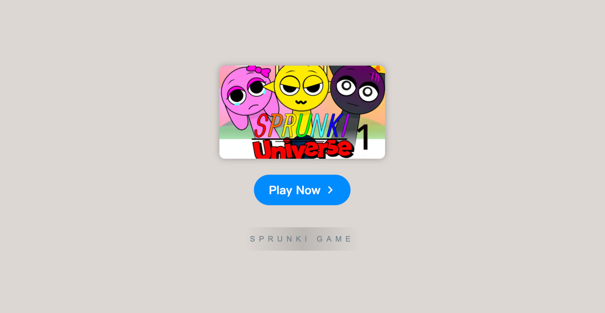

# Sprunki Universe 1

    

Welcome to **[Sprunki Universe 1](https://sprunkionline.com/universe-1)**, a thrilling and creative extension of the Sprunki world. This guide will take you through the exciting features and gameplay mechanics that make Universe 1 a captivating experience for players of all kinds. Join us in exploring new challenges, characters, and sounds in this innovative twist on the original game.

### Table of Contents
- Introduction
- Features
- Rating & Reviews
- How to Play
- Community & Sharing
- Conclusion

### Introduction

**Sprunki Universe 1** offers players a unique gaming experience by introducing new elements to the beloved Sprunki universe. As part of this innovative expansion, Universe 1 brings together original characters, atmospheric soundtracks, and interactive gameplay mechanics. Whether you're a veteran of the original game or new to the world of Sprunki, Universe 1 promises hours of creative fun and challenges.

### Features

| Feature                  | Description                                                                                           |
|--------------------------|-------------------------------------------------------------------------------------------------------|
| **New Characters**        | Explore an entirely new set of characters, each bringing unique sounds and visual styles to the mix.  |
| **Expanded Gameplay**     | Dive into an expanded world with more features and challenges that deepen the game's mechanics.        |
| **Sprunki Soundtracks**   | Enjoy new, haunting soundscapes designed to enhance the immersive experience of the game.              |
| **Community Sharing**     | Share your creations with other players and receive feedback from the growing Sprunki community.       |
| **Free Access**           | Play Sprunki Universe 1 for free in your browser without any downloads.                               |

### Rating & Reviews

Sprunki Universe 1 has received high praise from both new and experienced players. Here’s what the community has to say:

    

        <svg width="16" viewBox="0 -960 960 960" height="16" xmlns="http://www.w3.org/2000/svg" style="--backgroundColor: #ffd223; --hoverColor: #ffd223; fill: #ffd223;">
            <path d="m233-80 65-281L80-550l288-25 112-265 112 265 288 25-218 189 65 281-247-149L233-80Z" shape-rendering="geometricPrecision"></path>
        </svg>
        <svg width="16" viewBox="0 -960 960 960" height="16" xmlns="http://www.w3.org/2000/svg" style="--backgroundColor: #ffd223; --hoverColor: #ffd223; fill: #ffd223;">
            <path d="m233-80 65-281L80-550l288-25 112-265 112 265 288 25-218 189 65 281-247-149L233-80Z" shape-rendering="geometricPrecision"></path>
        </svg>
        <svg width="16" viewBox="0 -960 960 960" height="16" xmlns="http://www.w3.org/2000/svg" style="--backgroundColor: #ffd223; --hoverColor: #ffd223; fill: #ffd223;">
            <path d="m233-80 65-281L80-550l288-25 112-265 112 265 288 25-218 189 65 281-247-149L233-80Z" shape-rendering="geometricPrecision"></path>
        </svg>
        <svg width="16" viewBox="0 -960 960 960" height="16" xmlns="http://www.w3.org/2000/svg" style="--backgroundColor: #ffd223; --hoverColor: #ffd223; fill: #ffd223;">
            <path d="m233-80 65-281L80-550l288-25 112-265 112 265 288 25-218 189 65 281-247-149L233-80Z" shape-rendering="geometricPrecision"></path>
        </svg>
        <svg width="16" viewBox="0 -960 960 960" height="16" xmlns="http://www.w3.org/2000/svg" style="--backgroundColor: #9E9E9E; --hoverColor: #9E9E9E; fill: #9E9E9E;">
            <path d="m233-80 65-281L80-550l288-25 112-265 112 265 288 25-218 189 65 281-247-149L233-80Z" shape-rendering="geometricPrecision"></path>
        </svg>
    

### How to Play

To get started with **Sprunki Universe 1**, follow these easy steps:

1. **Launch the Game**: Open the game in your web browser.
2. **Choose Your Characters**: Select from a variety of new characters and sounds.
3. **Create Music**: Drag and drop characters into your track to create beats and rhythms.
4. **Share Your Creations**: Save your tracks and share them with the growing Sprunki community.

### Community & Sharing

**Sprunki Universe 1** encourages community engagement through the sharing of music creations. You can save your compositions, receive feedback from other players, and explore others' tracks for inspiration. Whether you’re an amateur or a seasoned music creator, Sprunki’s interactive community adds an extra layer of fun to the experience.

### Conclusion

In conclusion, **Sprunki Universe 1** offers a fresh take on the Sprunki universe with exciting new features, characters, and sounds. Whether you’re looking to express your creativity or simply enjoy the game’s eerie atmosphere, there’s something for everyone. Join the fun and explore this new world today!

[Play Sprunki Universe 1](https://sprunkionline.com/universe-1)
